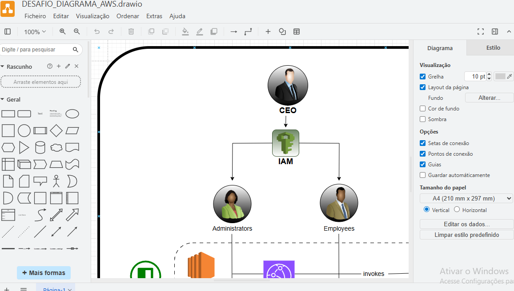

# 🚀 Desafio DIO - AWS Step Functions

Este repositório contém minhas anotações, insights e práticas desenvolvidas no laboratório da **DIO** sobre **AWS Step Functions**, consolidando o aprendizado sobre workflows automatizados e orquestração de serviços na nuvem.

---

## 📖 Objetivo do Desafio
- Aplicar conceitos de **orquestração com Step Functions**.
- Criar workflows automatizados integrando serviços AWS (ex.: Lambda, S3, DynamoDB, SNS, SQS).
- Documentar a experiência de forma clara e organizada.
- Utilizar o GitHub para centralizar anotações e compartilhar conhecimento.

---

## 🛠️ Tecnologias Utilizadas
- **AWS Step Functions**
- **AWS Lambda**
- **Amazon S3**
- **Amazon DynamoDB**
- **Amazon SNS / SQS**
- **GitHub** (documentação e versionamento)

---

## 📂 Estrutura do Repositório
📂 dio-aws-step-functions-desafio
┣ 📂 images
┃ ┣ screenshot1.png
┃ ┗ screenshot2.png
┣ 📜 README.md
┗ 📜 workflow-definition.json

---

## ⚙️ O que foi feito
1. **Criação de um workflow no AWS Step Functions**  
   - Orquestração de funções Lambda para validação de arquivos.
   - Integração com S3 para armazenamento de dados.
   - Uso de DynamoDB para persistência de informações.  
   - Notificações via SNS/SQS.

2. **Execução e monitoramento**  
   - Teste de entradas simuladas.
   - Monitoramento da execução pelo console Step Functions.

3. **Documentação e insights**  
   - Anotações de boas práticas de arquitetura.
   - Reflexões sobre mensageria, automação e escalabilidade.

---

## 📸 Evidências
*(incluir prints da console do AWS Step Functions e integrações realizadas)*  
Exemplo:  

---

## 💡 Insights Aprendidos
- A importância de **orquestrar serviços sem precisar de muito código**.  
- Step Functions facilita a **observabilidade** (monitoramento das etapas).  
- O uso combinado com **Lambda + SQS + DynamoDB** gera **arquiteturas serverless altamente escaláveis**.  
- Documentar o processo ajuda a fixar os conceitos e serve como guia futuro.  

---

## 📌 Conclusão
Este desafio foi essencial para consolidar o entendimento sobre **orquestração de workflows na AWS**.  
O **AWS Step Functions** se mostrou uma ferramenta poderosa para criar pipelines escaláveis e monitoráveis com pouco esforço de código.

---

## 🔗 Links úteis
- [AWS Step Functions - Documentação Oficial](https://docs.aws.amazon.com/step-functions)
- [Guia de Markdown do GitHub](https://www.markdownguide.org/basic-syntax/)
- [GitHub Quick Start](https://github.com/brendaaraujocampos)

---
👩‍💻 Desafio desenvolvido por **Brenda Campos**.
